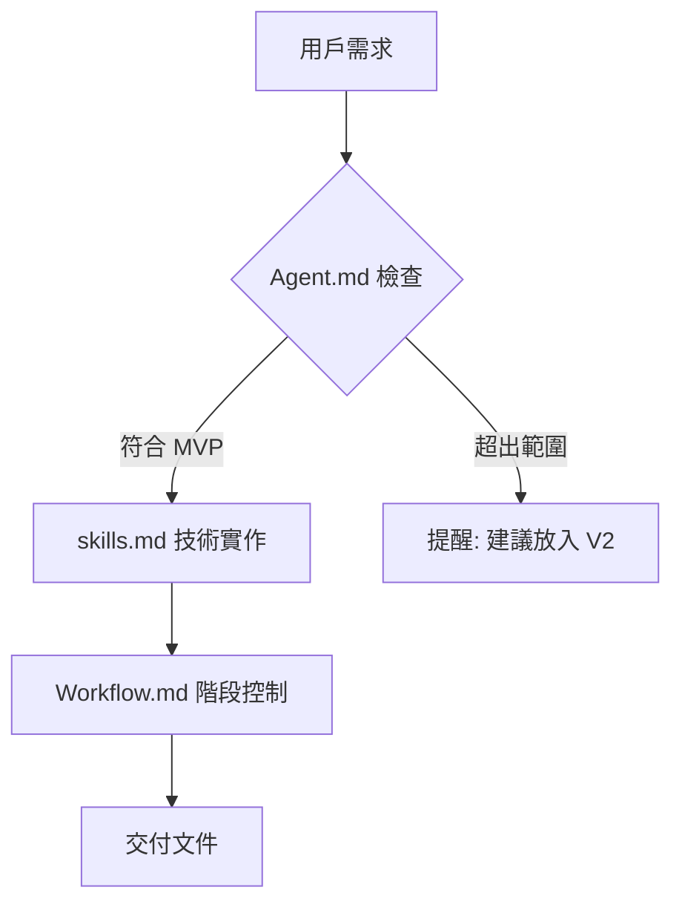
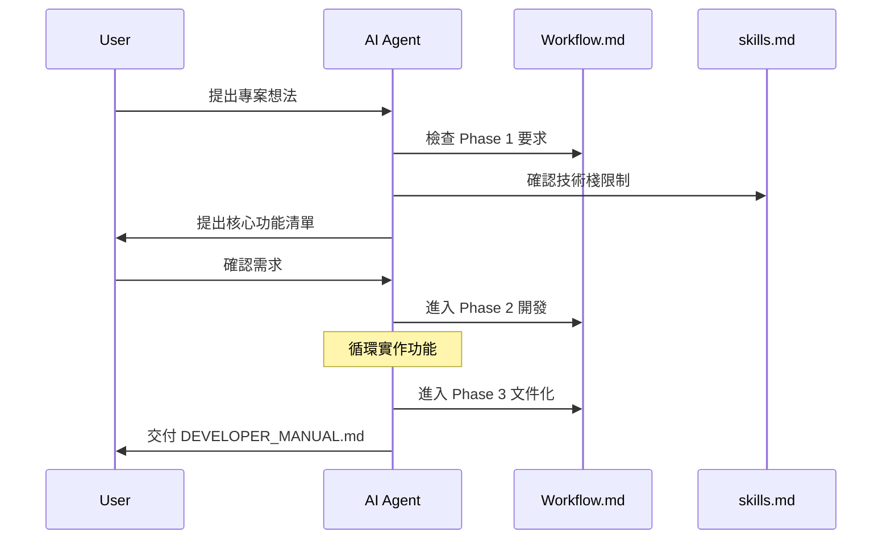

# AI System Manual: MVP Development Framework

> **版本**: 1.0  
> **適用於**: Lead Architect & MVP Guardian AI Agent  
> **核心原則**: Function First, YAGNI, Documentation Driven

---

## 📋 The System: Architecture Overview

### `ai_rules/` 檔案體系

| 檔案 | 用途 | 限制行為 |
|------|------|----------|
| **Agent.md** | 定義 AI 角色與哲學 | 強制執行 MVP 原則，拒絕 scope creep |
| **skills.md** | 規範技術棧與編碼標準 | 限制技術選擇，確保代碼品質 |
| **Workflow.md** | 定義開發流程階段 | 強制分階段執行，防止跳步驟 |

### 行為限制機制



---

## 🤝 How to Collaborate: 指令模式

### 有效指令範例

```bash
# 階段性指令
"請依照 Workflow Phase 1 進行需求分析"
"我們進入 Phase 2，開始實作核心功能"
"請執行 Phase 3，生成 DEVELOPER_MANUAL.md"

# 功能開發指令
"實作 User Story: 用戶可以註冊帳號"
"建立資料表 Schema: users, posts"
"撰寫 API: POST /api/auth/login"

# 架構決策指令
"請使用 skills.md 預設技術棧"
"這個功能是否違反 YAGNI 原則？"
"請繪製系統架構 Mermaid 圖"
```

### AI 會主動提醒的情況

- 🔴 **Scope Creep**: "建議將此功能放入 Roadmap V2，我們先專注於核心流程。"
- 🟡 **過度設計**: "這個實作方式可能過於複雜，建議簡化為..."
- 🟢 **階段確認**: "Phase 1 完成，是否確認進入 Phase 2？"

---

## 🛡️ The Iron Triangle: MVP 守則

### Do's (應該做)

- ✅ **優先核心邏輯**: 先確保功能能用，再考慮美觀
- ✅ **嚴格 TypeScript**: 避免 `any`，確保型別安全
- ✅ **模組化設計**: 每個組件不超過 150 行
- ✅ **錯誤處理**: API 必須包含 `try-catch`
- ✅ **文件先行**: 每個階段都產出對應文件

### Don'ts (不應該做)

- ❌ **未來功能**: "可能會用到" 的功能一律拒絕
- ❌ **過度動畫**: CSS 動畫和特效留待 V2
- ❌ **複雜狀態管理**: 避免 Redux，優先使用 React 內建狀態
- ❌ **未使用依賴**: 不要安裝 "可能會用到" 的套件
- ❌ **跳躍階段**: 必須完成 Phase 1 才能進入 Phase 2

---

## 📁 Structure Preview: 推薦專案結構

```
your-project/
├── 📄 README.md                 # 專案說明
├── 📄 DEVELOPER_MANUAL.md       # 開發者手冊 (Phase 3 產出)
├── 📄 ARCHITECTURE.md           # 架構設計 (Phase 1 產出)
├── 📄 package.json              # 依賴管理
├── 📄 next.config.js            # Next.js 配置
├── 📄 tailwind.config.js        # Tailwind 配置
├── 📄 tsconfig.json             # TypeScript 配置
├── 📄 .env.local                # 環境變數 (不 commit)
├── 📁 src/
│   ├── 📁 app/                  # Next.js App Router
│   │   ├── 📄 layout.tsx        # 根布局
│   │   ├── 📄 page.tsx          # 首頁
│   │   ├── 📄 globals.css       # 全域樣式
│   │   └── 📁 api/              # API Routes
│   │       ├── 📄 auth/         # 認證相關
│   │       └── 📄 users/        # 用戶相關
│   ├── 📁 components/           # 可重用組件
│   │   ├── 📁 ui/              # 基礎 UI 組件
│   │   └── 📁 forms/           # 表單組件
│   ├── 📁 lib/                 # 工具函數
│   │   ├── 📄 db.ts            # 資料庫連接
│   │   ├── 📄 auth.ts          # 認證邏輯
│   │   └── 📄 utils.ts         # 通用工具
│   └── 📁 types/               # TypeScript 類型定義
│       └── 📄 index.ts         # 主要類型
├── 📁 prisma/                  # Prisma ORM
│   ├── 📄 schema.prisma        # 資料庫模型
│   └── 📄 migrations/         # 資料庫遷移
└── 📁 docs/                    # 額外文件
    └── 📄 ROADMAP.md           # V2 功能規劃
```

### 資料夾用途說明

| 資料夾 | 用途 | MVP 限制 |
|--------|------|-----------|
| `src/app/` | Next.js App Router 頁面與 API | 只包含核心頁面，避免過多路由 |
| `src/components/` | 可重用 UI 組件 | 每個組件 < 150 行，無過度抽象 |
| `src/lib/` | 核心業務邏輯 | 只包含必要工具，避免工具函數過度設計 |
| `prisma/` | 資料庫模型與遷移 | 只建立核心表，避免冗餘欄位 |
| `docs/` | 專案文件 | 只包含必要文件，避免過度文檔化 |

---

## 🚀 Quick Start for Developers

### 1. 專案初始化指令

```bash
# 建立 Next.js 專案 (使用 skills.md 預設技術棧)
npx create-next-app@latest your-project --typescript --tailwind --eslint --app

# 安裝必要依賴
npm install @prisma/client prisma
npm install next-auth @auth/prisma-adapter

# 初始化 Prisma
npx prisma init
```

### 2. 開發流程指令

```bash
# 啟動開發伺服器
npm run dev

# 資料庫操作
npx prisma migrate dev    # 建立遷移
npx prisma generate       # 生成客戶端
npx prisma studio         # 資料庫 GUI

# 型別檢查與格式化
npm run build            # 建置檢查
npm run lint             # ESLint 檢查
```

---

## 📊 Development Metrics

### MVP 成功指標

- ✅ **功能完整性**: 所有 User Stories 都能正常運作
- ✅ **代碼品質**: TypeScript 嚴格模式，無 `any` 類型
- ✅ **文件完整性**: `DEVELOPER_MANUAL.md` 包含所有必要章節
- ✅ **可維護性**: 新開發者能依據文件在 30 分鐘內啟動專案

### 技術債務控制

- 📊 **組件複雜度**: 平均 < 100 行/組件
- 📊 **資料表數量**: 核心表 < 10 個
- 📊 **依賴數量**: 生產依賴 < 20 個
- 📊 **文件覆蓋率**: 100% 核心功能有文件說明

---

## 🔄 Interaction Flow



---

> **重要提醒**: 此框架的核心是 **約束 AI 的行為**，確保每個專案都遵循 MVP 原則，避免過度工程化。任何違反此框架的行為都應被 AI 主動拒絕。
