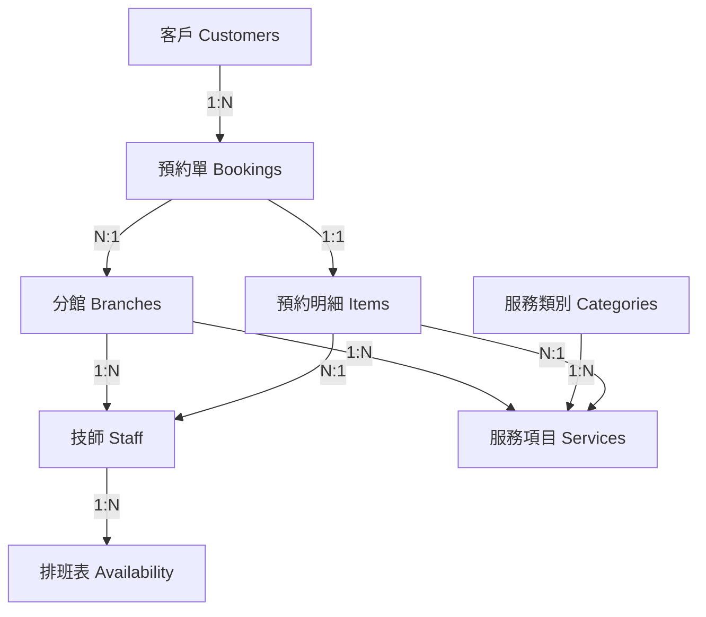

# 預訂/預約 管理系統升級計劃 (Booking System Upgrade Plan)

本計劃書針對現有 `contact.html` (御手國醫預約網) 及其潛在後端架構進行全面升級分析。目標是將現有的靜態/動態混合頁面轉型為現代化、基於 SQL 資料庫的穩健預約管理系統。

---

## 1. 現狀分析 (Current System Analysis)

### 1.1 前端介面 (Frontend)
*   **技術棧**: HTML, jQuery, SweetAlert, 內嵌 CSS/JS。
*   **運作邏輯**:
    *   使用者依序選擇：分館 (`p_id`) -> 服務類別 (`kind_id`) -> 服務項目 (`s_id`) -> 指定技師 (`m_id`)。
    *   資料交互依賴 AJAX 請求傳統 ASP 頁面 (`get_pid.asp`, `get_type.asp`, `get_member.asp`)。
    *   **痛點**: 前後端耦合度高，維護困難；缺乏明確的錯誤處理與用戶反饋機制；依賴過時的 DOM 操作方式。

### 1.2 後端與資料 (Backend & Data) - 推測
*   **技術棧**: Classic ASP (Active Server Pages)。
*   **資料存儲**: 極可能為 Access 資料庫或舊版 SQL Server，甚至可能是純文字檔或 Excel。
*   **痛點**: 擴展性差，安全性低 (SQL Injection 風險)，無法應對高併發預約，缺乏事務處理 (Transaction) 保障。

---

## 2. 系統需求 (System Requirements)

### 2.1 功能性需求 (Functional)
1.  **多據點管理 (Multi-Branch Support)**: 支援不同分館（如台南會館、中華會館等）獨立管理。
2.  **彈性服務配置 (Flexible Service Configuration)**: 服務項目、時長、價格可動態配置。
3.  **技師排班與狀態 (Technician Scheduling)**: 技師排班表、請假、即時忙碌狀態。
4.  **即時預約 (Real-time Booking)**: 防止重複預約 (Double Booking)。
5.  **會員系統 (Customer Profiles)**: 記錄客戶偏好、歷史消費、黑名單。
6.  **通知系統 (Notification)**: SMS/Email 通知客戶與管理員。
7.  **報表與分析 (Reporting)**: 營收報表、技師績效、熱門時段分析。

### 2.2 非功能性需求 (Non-functional)
1.  **資料一致性 (ACID)**: 確保預約交易的完整性。
2.  **高可用性 (High Availability)**: 支援擴展，確保 24/7 預約服務。
3.  **安全性 (Security)**: 個資加密 (PII Protection)，HTTPS，防止 SQL Injection。

---

## 3. 系統架構設計 (System Architecture) - 採用 Nuxt 3 + Prisma + PostgreSQL + Tailwind

經過評估，您提出的 **Nuxt 3 + Prisma + PostgreSQL + Tailwind** 組合是目前開發預約系統的 **黃金陣容 (Golden Stack)**。此組合完美平衡了開發速度、維護性、效能與 SEO 需求。

### 3.1 架構優勢分析 (Stack Analysis)

| 技術組件 | 角色 | 針對本專案的優勢 (Why this fit?) |
| :--- | :--- | :--- |
| **Nuxt 3 (Vue 3)** | **全端框架 (Fullstack Framework)** | **SEO 與 SSR**: 預約網需要被 Google 搜尋到 (SEO)，Nuxt 的伺服器端渲染 (SSR) 是最佳解。<br>**Server API**: Nuxt 內建 Nitro 引擎，可直接撰寫 `/server/api` 後端邏輯，**不需額外架設獨立後端 Server**，大幅降低部署複雜度。<br>**DX 體驗**: 自動路由、自動引入，開發效率極高。 |
| **Prisma** | **資料庫 ORM** | **Type Safety**: 與 TypeScript 完美結合，從資料庫到前端享有完整的型別保護。<br>**關聯處理**: 本系統有複雜的多對多關聯 (技師-服務、預約-服務)，Prisma Schema 定義清晰且易於維護。<br>**Migration**: 自動生成資料庫遷移檔，版控管理資料庫變更。 |
| **PostgreSQL** | **關聯式資料庫 (RDBMS)** | **一致性 (ACID)**: 預約交易絕不能出錯，Postgres 的 Transaction 支援最穩健。<br>**JSON 支援**: 部分彈性欄位 (如會員備註、特殊需求) 可直接存為 JSONB。<br>**擴充性**: 業界標準，支援高併發讀寫。 |
| **Tailwind CSS** | **樣式系統 (Styling)** | **RWD 優先**: 預約網 80% 流量來自手機，Tailwind 的 Mobile-first 設計理念能快速刻出響應式介面。<br>**設計一致性**: 透過 `tailwind.config.js` 定義品牌色 (Brand Colors)，確保全站視覺統一。<br>**維護性**: 不再有全域 CSS 污染問題。 |

### 3.2 系統資料流 (Data Flow)

1.  **Client (Browser)**: 使用者操作 Nuxt 頁面，Tailwind 負責 RWD 樣式呈現。
2.  **API Layer (Nuxt server/api)**: 前端透過 `useFetch` 呼叫內建 API。
    *   例如: `await useFetch('/api/booking/create')`
3.  **Data Access (Prisma Client)**: API 層透過 Prisma 與資料庫溝通。
    *   例如: `await prisma.booking.create({ data: ... })`
4.  **Database (PostgreSQL)**: 執行實際 SQL 查詢與交易處理。

### 3.3 專案結構建議 (Project Structure)

```text
/e111-booking-system (Nuxt 3)
├── /server
│   ├── /api            # Backend API routes
│   │   ├── /bookings
│   │   │   ├── index.get.ts  # GET 查詢預約
│   │   │   └── create.post.ts # POST 建立預約
│   │   └── /staff
│   └── /utils          # 後端專用工具 (如 Prisma Client instance)
├── /prisma
│   ├── schema.prisma   # 定義 PostgreSQL 資料庫結構
│   └── /migrations     # 資料庫變更紀錄
├── /components         # Vue UI 元件 (Buttons, Cards)
├── /pages              # 透過檔案系統自動產生路由
│   ├── index.vue       # 首頁
│   ├── booking.vue     # 預約流程主頁
│   └── admin.vue       # 管理後台
├── tailwind.config.ts  # 設計系統配置
└── nuxt.config.ts      # 專案配置
```

---

## 4. 資料庫架構設計 (Database Schema Design) - 核心升級

以下採用標準 SQL 設計規範 (3NF)，確保資料正規化。

### 4.1 核心實體關係圖 (ER Concept)



### 4.2 詳細 SQL 表結構定義

#### 1. 分館資料表 (Branches)
存儲各分館的基本資訊。
```sql
CREATE TABLE branches (
    branch_id INT PRIMARY KEY AUTO_INCREMENT,
    name VARCHAR(100) NOT NULL COMMENT '分館名稱，如：台南會館',
    code VARCHAR(20) UNIQUE COMMENT '分館代碼，如：TNN01',
    address VARCHAR(255),
    phone VARCHAR(20),
    line_url VARCHAR(255) COMMENT 'LINE 連結',
    is_active BOOLEAN DEFAULT TRUE,
    created_at TIMESTAMP DEFAULT CURRENT_TIMESTAMP
);
```

#### 2. 服務類別 (Service_Categories)
對應原有的 `kind_id` (如：腳底按摩、全身指壓)。
```sql
CREATE TABLE service_categories (
    category_id INT PRIMARY KEY AUTO_INCREMENT,
    name VARCHAR(50) NOT NULL COMMENT '類別名稱',
    icon_url VARCHAR(255) COMMENT '對應 ICON 圖片路徑',
    sort_order INT DEFAULT 0 COMMENT '排序權重'
);
```

#### 3. 服務項目 (Services)
對應原有的 `s_id` (如：漢方足底按摩/60分鐘)。
```sql
CREATE TABLE services (
    service_id INT PRIMARY KEY AUTO_INCREMENT,
    category_id INT NOT NULL,
    name VARCHAR(100) NOT NULL,
    duration_minutes INT NOT NULL COMMENT '服務時長',
    base_price DECIMAL(10, 2) NOT NULL COMMENT '定價',
    description TEXT,
    image_url VARCHAR(255),
    is_active BOOLEAN DEFAULT TRUE,
    FOREIGN KEY (category_id) REFERENCES service_categories(category_id)
);
```

#### 4. 技師資料 (Staff)
對應原有的 `member` / `m_id`。包含技師專長與所屬分館。
```sql
CREATE TABLE staff (
    staff_id INT PRIMARY KEY AUTO_INCREMENT,
    branch_id INT NOT NULL,
    staff_code VARCHAR(20) NOT NULL COMMENT '技師編號，如：36, F38',
    name VARCHAR(50),
    photo_url VARCHAR(255),
    level ENUM('Junior', 'Senior', 'Master', 'Star') DEFAULT 'Senior' COMMENT '技師等級，對應五星技師邏輯',
    is_active BOOLEAN DEFAULT TRUE,
    FOREIGN KEY (branch_id) REFERENCES branches(branch_id),
    UNIQUE (branch_id, staff_code) -- 同一分館編號唯一
);
```

#### 5. 技師排班與可用性 (Staff_Availability)
這是預約系統的核心，用於判斷技師是否可被預約。
```sql
CREATE TABLE staff_availability (
    availability_id INT PRIMARY KEY AUTO_INCREMENT,
    staff_id INT NOT NULL,
    date DATE NOT NULL,
    start_time TIME NOT NULL,
    end_time TIME NOT NULL,
    status ENUM('Available', 'Booked', 'Leave', 'Break') DEFAULT 'Available',
    FOREIGN KEY (staff_id) REFERENCES staff(staff_id),
    INDEX idx_search (staff_id, date, status) -- 加速查詢
);
```

#### 6. 客戶資料 (Customers)
```sql
CREATE TABLE customers (
    customer_id INT PRIMARY KEY AUTO_INCREMENT,
    name VARCHAR(50) NOT NULL,
    phone VARCHAR(20) NOT NULL UNIQUE,
    email VARCHAR(100),
    line_id VARCHAR(50),
    notes TEXT COMMENT '客戶備註/黑名單註記',
    created_at TIMESTAMP DEFAULT CURRENT_TIMESTAMP
);
```

#### 7. 預約主表 (Bookings)
交易核心，記錄預約狀態。
```sql
CREATE TABLE bookings (
    booking_id BIGINT PRIMARY KEY AUTO_INCREMENT,
    booking_ref VARCHAR(20) UNIQUE NOT NULL COMMENT '預約代號，供查詢用',
    customer_id INT NOT NULL,
    branch_id INT NOT NULL,
    booking_time TIMESTAMP NOT NULL COMMENT '預約開始時間',
    total_duration INT NOT NULL COMMENT '總時長(分)',
    total_price DECIMAL(10, 2) NOT NULL,
    payment_status ENUM('Unpaid', 'Paid', 'Refunded') DEFAULT 'Unpaid',
    status ENUM('Pending', 'Confirmed', 'Completed', 'Cancelled', 'NoShow') DEFAULT 'Pending',
    created_at TIMESTAMP DEFAULT CURRENT_TIMESTAMP,
    FOREIGN KEY (customer_id) REFERENCES customers(customer_id),
    FOREIGN KEY (branch_id) REFERENCES branches(branch_id),
    INDEX idx_time_branch (booking_time, branch_id)
);
```

#### 8. 預約明細 (Booking_Items)
支援一次預約多種服務或多人服務。
```sql
CREATE TABLE booking_items (
    item_id BIGINT PRIMARY KEY AUTO_INCREMENT,
    booking_id BIGINT NOT NULL,
    service_id INT NOT NULL,
    staff_id INT COMMENT '指定技師，若不指定則為 NULL',
    price DECIMAL(10, 2) NOT NULL COMMENT '實際成交價',
    start_time TIMESTAMP NOT NULL,
    end_time TIMESTAMP NOT NULL,
    FOREIGN KEY (booking_id) REFERENCES bookings(booking_id),
    FOREIGN KEY (service_id) REFERENCES services(service_id),
    FOREIGN KEY (staff_id) REFERENCES staff(staff_id)
);
```

---

## 5. API 介面規劃 (API Specification)

將舊有的 ASP 邏輯轉換為 RESTful API：

1.  **取得分館列表**: `GET /api/branches`
    *   Response: `[{ id: 1, name: "台南會館", ... }]`
2.  **取得服務類別**: `GET /api/services/categories`
3.  **取得特定類別服務**: `GET /api/services?categoryId=1`
4.  **取得技師列表**: `GET /api/staff?branchId=1&serviceId=2`
    *   這是原 `change_m()` 的邏輯，需根據服務項目過濾有技能的技師。
5.  **查詢可用時段 (核心)**: `GET /api/availability?branchId=1&serviceId=2&date=2023-10-27`
    *   回傳該日可預約的時段 (Time Slots)。
6.  **建立預約**: `POST /api/bookings`
    *   Body: `{ customerInfo: {...}, items: [{ serviceId: 1, staffId: 36, time: "..." }] }`
7.  **查詢預約**: `GET /api/bookings/{ref}`

---

## 6. 遷移與實施路徑 (Implementation Roadmap) - Nuxt 3 專屬路徑

### 第一階段：專案初始化 (Initialization)
1.  **建立專案**: `npx nuxi init e111-booking`
2.  **安裝依賴**:
    *   `npm install -D tailwindcss postcss autoprefixer` (UI)
    *   `npm install prisma --save-dev` (Database Tool)
    *   `npm install @prisma/client` (Database Client)
3.  **配置 Tailwind**: 設定 `tailwind.config.js` 導入御手國醫品牌色。

### 第二階段：資料庫與 API 開發 (Database & Backend)
1.  **Schema 定義**: 在 `prisma/schema.prisma` 中編寫第 4 節定義的 Table 結構。
2.  **Migration**: 執行 `npx prisma migrate dev` 同步至 PostgreSQL。
3.  **API 實作 (`/server/api`)**:
    *   開發 `branches.get.ts` (取得分館)
    *   開發 `availability.get.ts` (查詢技師空檔 - 核心邏輯)
    *   開發 `booking.post.ts` (寫入預約單)

### 第三階段：前端頁面開發 (Frontend UI)
1.  **元件封裝**: 製作 `BookingCard`, `StaffSelector`, `TimeSlotPicker` 等 Vue 元件。
2.  **狀態管理**: 使用 Nuxt 內建 `useState` 或 Pinia 管理預約流程狀態 (Step 1 -> Step 4)。
3.  **整合 API**: 對接第二階段開發的 API 接口。

### 第四階段：部署與優化 (Deploy)
1.  **部署環境**: 推薦使用 Vercel (無伺服器) 或自建 Node.js Server (PM2) 搭配 Nginx。
2.  **PostgreSQL 託管**: 建置 Supabase 或自行架設 Docker。
3.  **SEO 檢查**: 設定 `useHead` 確保 Meta Tags 完整。

---

## 7. 結論

本升級計劃通過引入正規化的 **SQL 資料庫設計**，解決了現有系統資料分散、難以管理的問題。模組化的 API 設計不僅能支援目前的網頁預約，更為未來可能的 App 開發或第三方平台串接 (如 LINE 預約) 打下堅實基礎。
